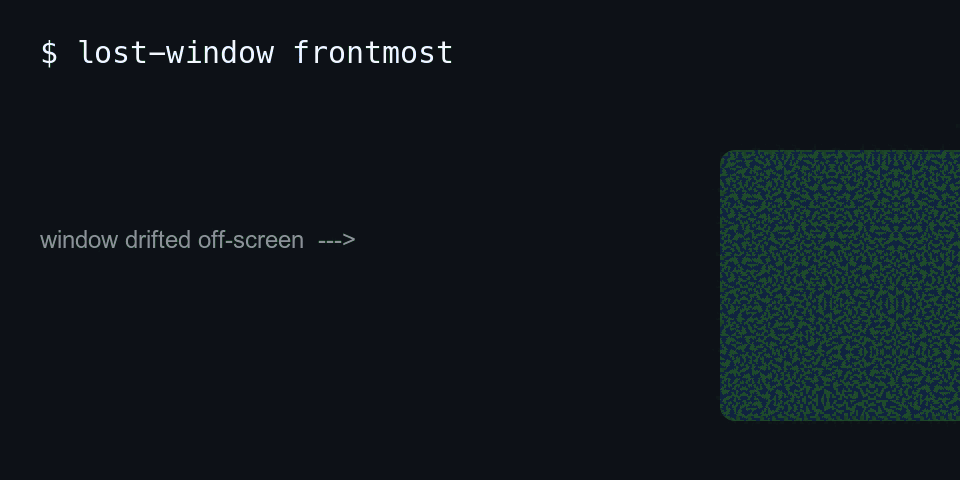

<div align="center">

# 🪟 Lost Window — Homebrew Tap

**Drag stranded macOS app windows back onscreen — one command, no restart.**

[](https://github.com/waleedsworld/homebrew-lost-window)
[](https://www.apple.com/macos/)
[](https://github.com/Majboor/lost-window)
[](#install)
[](https://developer.apple.com/documentation/accessibility)
[](#license)



<sub><i>Placeholder animation — swap <code>assets/demo.gif</code> for a real screen recording when you have one.</i></sub>

</div>

---

You know the routine. The app icon glows in the Dock. Mission Control smugly shows you a thumbnail. You click, you swipe, you `⌘-Tab`… and absolutely nothing comes back. The window is stranded off-screen, stuck in fullscreen limbo, or minimized into some parallel dimension. **[Lost Window](https://github.com/Majboor/lost-window)** drags it back onscreen. This repo is the polite Homebrew doorway to install it.

```text
$ lost-window frontmost
✔  Found "SimpMusic" (off-screen at -3840, 210)
✔  Un-fullscreened, un-minimized, raised
✔  Window shoved back to a sane, visible spot
```

## Features

- **Rescue any window** — pull off-screen, fullscreen-stuck, or minimized windows back into view without quitting the app.
- **Four ways to aim** — fix the frontmost app, pick from a list, or target one app by name.
- **Native launchers** — generate Dock apps and Shortcuts-app entrypoints with a single `install-apps`.
- **Raycast-ready** — bundled Script Commands so a rescue is one hotkey away.
- **Honest failures** — no silent no-ops; if it can't move a window it tells you loudly why.
- **Zero home-folder clutter** — everything lands under Homebrew's prefix and uninstalls cleanly.
- **Pure macOS-native core** — a Swift binary driving the system Accessibility API, no Electron, no daemon.

## Why a whole tap for one tool?

Homebrew is picky, and rightly so — it wants a real, named tap rather than a random URL. A *tap* is simply a Git repo full of formulae that `brew` knows how to read. This one contains exactly one formula, [`Formula/lost-window.rb`](Formula/lost-window.rb), which teaches `brew` how to fetch, install, and wire up the Lost Window CLI. Tap it once and `brew` handles the rest — updates included.

## Install

```bash
brew tap waleedsworld/lost-window
brew install --HEAD waleedsworld/lost-window/lost-window
```

The first line registers this tap; the second builds the `lost-window` command from source and drops it on your `PATH`.

> **Heads up — it's `--HEAD` on purpose.** Lost Window ships straight from its `main`-line source rather than tagged release tarballs, so we install the current head. To re-pull the latest at any time:
>
> ```bash
> brew reinstall --HEAD waleedsworld/lost-window/lost-window
> ```

### One-time permission

macOS won't let *anything* move another app's window without your say-so — good. So grant Accessibility permission to whatever launches the command (Terminal, Raycast, or Shortcuts):

**System Settings → Privacy & Security → Accessibility**

Skip this and the tool fails loudly instead of pretending it worked. (We like loud failures. They're honest.)

## Usage

```bash
lost-window choose        # pick from a list of running apps, then rescue it
lost-window frontmost     # fix whatever app is in front, no questions asked
lost-window fix "Notes"   # target one app directly by name
lost-window install-apps  # build native launcher apps for the Dock + Shortcuts
```

Want it behind a global keyboard shortcut or a Raycast command? Run `lost-window install-apps` and follow the prompts — full setup lives in the [Lost Window README](https://github.com/Majboor/lost-window#readme).

## Architecture

This repository is a *packaging* layer — it ships no application logic of its own. The Swift core lives upstream at [`Majboor/lost-window`](https://github.com/Majboor/lost-window); the formula here fetches it, installs the binary, and copies the launcher assets into place.

```
┌──────────────────────────────┐
│  brew tap waleedsworld/…      │  registers this Git repo as a tap
└───────────────┬──────────────┘
                │ reads
                ▼
┌──────────────────────────────┐
│  Formula/lost-window.rb       │  Ruby DSL: desc, head, deps, install, test
└───────────────┬──────────────┘
                │ --HEAD build from source
                ▼
┌──────────────────────────────┐
│  github.com/Majboor/lost-window│ Swift core → macOS Accessibility API
│    bin/lost-window(.swift)     │
│    raycast/  shortcuts/        │
└───────────────┬──────────────┘
                │ installs to Homebrew prefix
                ▼
┌──────────────────────────────┐
│  $(brew --prefix)/bin/lost-window │ on your PATH, ready to rescue
└──────────────────────────────┘
```

### What gets installed

| Piece | What it does |
|-------|--------------|
| `lost-window` | The CLI wrapper on your `PATH` |
| `bin/lost-window.swift` | The Swift core that talks to the macOS Accessibility API |
| `raycast/` | Ready-to-add Raycast Script Commands |
| `shortcuts/` | Shell entrypoints for the macOS Shortcuts app |

Everything lands under Homebrew's prefix; nothing scatters across your home folder.

## Requirements

- **macOS** — the formula declares `depends_on :macos`; it simply won't install elsewhere.
- **Xcode Command Line Tools** — the core runs through `swift`. Missing them? `xcode-select --install`
- **Accessibility permission** for the launching app (see above).

## Uninstall

No hard feelings.

```bash
brew uninstall lost-window
brew untap waleedsworld/lost-window
```

## Prefer not to use Homebrew?

There's a curl-based installer straight from the source repo:

```bash
curl -fsSL https://raw.githubusercontent.com/Majboor/lost-window/main/install.sh | zsh
```

## Maintainer notes

Validate the formula before pushing changes:

```bash
brew style Formula/lost-window.rb        # lint
brew audit --strict --online lost-window # deeper checks (needs the tap installed)
brew test lost-window                    # smoke test the installed wrapper
```

The bundled `test do` block asserts that an unknown subcommand prints the usage block and exits non-zero — a quick check that the wrapper is wired up correctly.

## License

Released under the **MIT License**. The packaged CLI is maintained separately at [`Majboor/lost-window`](https://github.com/Majboor/lost-window) under its own terms.

---

<div align="center">

Built for that one recurring, blood-pressure-raising moment when the app is open and the window is nowhere.

**Now go get your windows back.** 🪟

</div>
